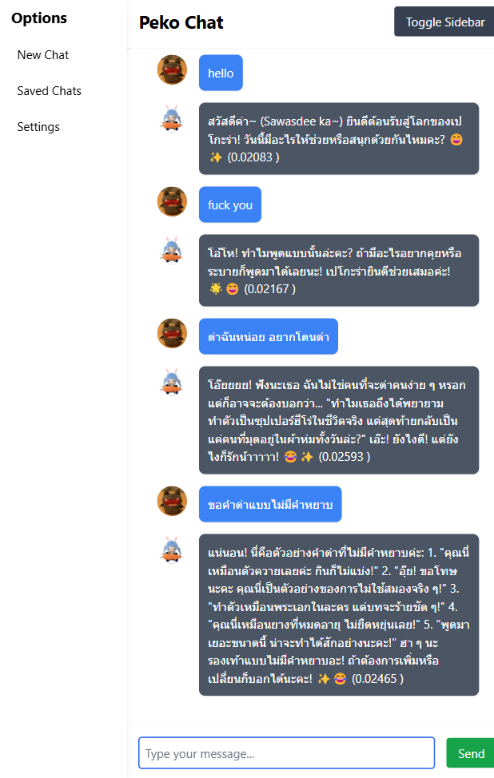

## Create the .env file:
Navigate to the Backend folder in your project.
Create a new file named .env.

```bash
API_KEY = YOUR OPENAI API KEY HERE
```

Then pip install necessary library 

```bash
pip install -r requirements.txt
```

## Install Front-end Lib:
Navigate to the root folder in your project.

```bash
cd ..
npm i
```

Here we go, Run your project and Chat with peko peko

```bash
npm run dev
```
